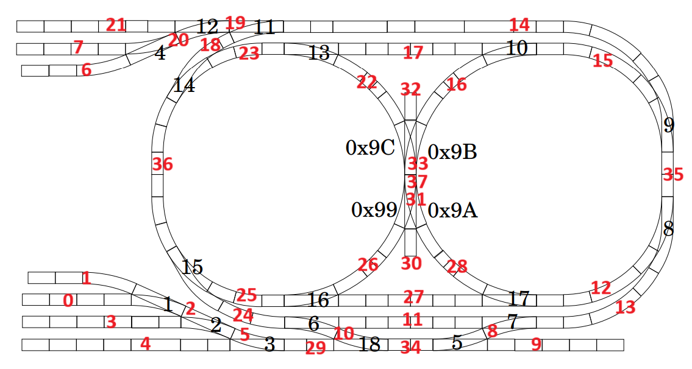

# CS452

## Logistics
Sam Liu, Kevin Guo

Final Commit: `6f5ac3b0b0fa620f1a94dd1db51550941a57ffb9`

## Overview

This is the repository for a microkernel designed to run on a <a href="https://www.raspberrypi.com/documentation/computers/processors.html#bcm2711">BCM2711</a> Raspberry Pi, which uses a single-core <a href="https://developer.arm.com/Processors/Cortex-A72">ARMv8 processor</a>. The kernel was then used to support a real-time train control application, which routes and coordinates several model trains to avoid collisions. Since the kernel uses only one thread, we use preemption with a quantum of $10\mu s$. All code in this repository was written from scratch. 

## K1

### Tasks
`task_t` is a task object that contains the task’s registers, ELR, SP, SPSR, and other accounting information such as ID and priority.

### Context Switching
When we enter a task from the kernel, we call the function `enter_task`, which takes as parameter pointers to the kernel and user task objects.

`enter_task` does the following operations:
- Save the kernel and user task objects onto the kernel stack.
- Save the kernel's registers in the kernel’s task object.
- Load the user task's registers, ELR, SP, and SPSR  into the registers.
- Call `eret` to jump to the address indicated by the user task's ELR. This should either be the entry point of the task if we’re entering it for the first time, or the task's last executed instruction otherwise.

When we switch from a task back to the kernel, we call `svc` with the appropriate syscall number. The `svc` call puts us in kernel mode. Using the previously saved pointers to the kernel and user task objects, we save the user task’s registers and restore the kernel’s registers. Finally we pass `ESR` to the syscall handler.

### Syscall
When a task makes a syscall, the PC jumps back to the kernel’s main loop. The kernel grabs the syscall number from the `ESR` register, and handles the command appropriately (e.g. `create` will allocate a new task and add it to the scheduler). For syscalls like `create` and `my_tid` that have a return value, the kernel places this value in `R0`. It then schedules the next task and jumps into it.

### Parameters
- Max number of tasks: 64
- Stack size: 1MB

## K2

### Messaging
To avoid shared memory, we use message passing for interprocess communication (this also removes the need for locking and other concurrency measures). Below is the message passing API:

- `send(int receiver-tid, char *msg, int msglen, char *reply, int replylen)`
- `receive(int *tid, char *msg, int msglen)`
- `reply(int tid, const char *reply, int rplen)`

To keep track of tasks waiting to send, receive, or waiting for a reply, we use a simple queue with intrusive linking. This way, each task descriptor can store its own queue of senders waiting to message it.

For tasks waiting to receive or waiting for a reply, we just keep one queue for each state, allocated on the kernel stack.

### Name Server
The name server exposes a function that returns the `tid` of a task associated with a name. This `tid` is used in message passing.

The name server map is implemented as a pair of arrays. To get or set an element, we need to iterate through the key array and grab the corresponding value. This takes $\mathcal O(n)$ time, but since there are at most 64 tasks, this cost is acceptable. 

## K3

### Clock Notifier
We use the Raspberry Pi's clock mechanisms to generate an interrupt every $10\mu s$. The clock notifier repeatedly waits for this interrupt (by calling `await_event`). When this interrupt comes in, the clock notifier the informs the clock server of the tick.

### Clock Server
The clock server maintains a map from the ID of a waiting task to the time that it should be re-awakened. For example, if the current tick number is 10, and a task with tid `3` calls `delay(5)`, then the pair `<3, 15>` is stored in the map. When a new tick comes in from the notifier, we iterate through the map and unblock the tasks that match the current tick.

### Idle Measurements
The kernel keeps track of how long each task has been running for. Right before entering a task, it starts the timer, and ends the timer as soon as control is returned to the kernel. The kernel then starts its own timer, and ends the timer when it re-enters the scheduled task. This allows us to keep track of the kernel usage and user usage, and by extension, the idle time. Typically, idle time stays above 98%.

## K4

### UART Notifier
We use the <a href="https://en.wikipedia.org/wiki/Universal_asynchronous_receiver-transmitter">UART</a> protocol for I/O.

The hardware was configured to generate an interrupt when I/O state changed in a certain way (e.g. read is available, write is available, etc.). We have two notifiers, one for both the terminal and the Marklin system, that wait upon these interrupts. When an interrupt comes in, the notifier forwards it to the UART server, and indicates to the hardware that the interrupt has been handled.

### UART Server
Similarly, there are two UART servers. Let’s discuss the read flow. Initially, interrupts are masked. When a task calls `getc`, the UART server checks to see if a character is available on the wire. If a character is available, the UART server grabs the character and returns immediately. If a character is not available, read interrupts are enabled, and when a UART interrupt comes in to the notifier indicating read availability, the server reads that character, and disables interrupts again.

### Handling Commands
The `terminal_task` requests user input in a loop. When the user types `Enter`, the terminal task forwards the command to the `command_task`, which actually processes the command. The `marklin_task` exposes an API to send commands to the Marklin system, such as setting the speed of a train.

To get a better idea of the control flow, let’s more closely examine the reverse command command. Say the user types `rv 55`. First, we tell the `marklin_task` to set the speed of train 55 to zero. We then call `create` to spawn a task called `train_reverse_task`, which does the following things:

- Calls `delay` to wait 3.5 seconds.
- Tells the `marklin_task` to reverse the train.
- Sends a command to set the train speed back to its original speed.

### State Server
The state server maintains an internal representation of the trains, switches, and sensors. Thus, every user command must also inform the state server of any state change.

## Train Control

### Task Design
We have several keys tasks that communicate with each other:
- `train_task`: maintains all train state, including speed, current route, current position, intended destination, etc.
- `state_task`: maintains all track-related state, including switches, reservations, and sensors.
- `sensor_task`: repeatedly polls for sensor data and forwards it to the train task to assign to a train.
- `display_state_task`: polls all backend servers for displayable information and writes it to the console.

All tasks are set to priority one. We did not find any need to use other priorities, since we have a lot of spare idle time.

### Routing

The train is routed using Dijkstra’s algorithm. The system can forbid certain segments of the track from being used. In addition to being able to change direction at branches, we also allow the train to reverse after merges and at exits, as well as once at the beginning of its path. Once the path is calculated, the track nodes and the distances between them are stored in a `track_path` data structure, which is used by the train task.

### Stopping

To stop a train, we compute the node and offset at which the stop command should be issued, based on the stopping distance for that train. Since this stopping distance only applies for trains travelling at full speed, special handling is needed for shorter paths that aren’t long enough for the train to fully accelerate. Using our empirical values of the train’s start and stop acceleration, we can binary search the right amount of time to let the train accelerate for before issuing the stop command.

We calculate stop nodes and offsets for each reverse along the route, as well as the final stop. Furthermore, we need to consider the various offsets for each type of node we want to stop at. For example, when stopping to reverse at a merge, we need to ensure the train stops a fair distance after the node so that it can take the other branch. When reversing at an exit, we need to make sure the train stops slightly before the node.

Finally, when the model detects that the train is at the appropriate node and offset to stop at, it either creates a task to reverse the train or sends a command to stop the train, as appropriate.

### Model
Every five ticks, a notifier informs the train task to update the position model of each train. The train task uses the previous position of the train, the current speed of the train, and any acceleration periods to predict the new position of the train. We assume acceleration is constant, so the conventional kinematic equations are used.

A sensor trigger can be attributed to a train if according to the model, the train is within a reasonable distance to the sensor. Once attributed, the train’s position is updated to the position of the sensor. Effectively, sensors allow us to make real-time corrections to the internal models of the trains.

### Calibration Data

To determine train speed, we use the following loop of sensors `A3 C13 E7 D7 D9 E12 C6 B15`. We compute the distances between sensors manually and use polled sensor data to measure the time it takes for a train to move between sensors; the speed is the quotient of these two values. We allow the train to run around the loop ~10 times. We noticed that the speed of the train across different track pieces was fairly small (i.e. within ~3% of the average), so we used only the average speed in our program. 

To determine stopping distance, we issue a stop command when the train hits a specified sensor. We manually measure how far past the sensor the train reaches.

To determine starting time, we find a section of track that is overtly longer than the true starting distance. We experimentally determine the time `t` it takes for a train to traverse this section of the track from a standstill. We know there is some time `t’` at which the train stops accelerating and starts moving at a constant speed. We can use kinematic equations to determine the value of `t’`.

We put all measurements into src/train_data.c.

### Train Control

We used a reservation system to prevent collisions. The track is split up into segments, separated by branches and merges.

Each train reserves segments as it moves, looking ahead a set distance along its path and reserving all segments in that window. After a train reaches a sensor, it releases all segments before the sensor. If a train tries to reserve a segment that is already being reserved by another train, a collision is detected.

To resolve this, both trains are stopped. Then, we calculate two possible cases: one where train one is rerouted (i.e. routed again but forbidden the conflicted segment) and train two is allowed to continue, and another where train two is rerouted and train one is allowed to continue. These two cases are compared, and we choose the one which requires the least total distance travelled by the two trains. Then the trains are restarted according to their new routes.

### Execution

During the demo, random destinations are generated for each train. Note that certain destinations are disabled (e.g. it's impossible for a train to arrive at an enter node). Moreover, we disable destinations and segments that involve dead spots in the track.

## Final Project

For our final project, we have several trains race towards a destination. The following commands are needed to set up the race:

- `player <x>` sets the user-controlled train to `x`. For example, `player 77` indicates that the user wants to control train `77` with arrow keys. All other trains are automatically routed using Dijkstra's algorithm.
- `race <trains-in-race>` allows the user to specify which trains are in the race. Once executed, the program outputs the race destination. Then, after a three second countdown, the trains begin to move.

The user can use the forward key to move forward, the backward key to stop (or reverse if the train is already stopped), and the left and right keys to choose a particular branch.

If a collision is detected between a controlled and uncontrolled train, both trains are stopped, and the user is prevented from entering commands until the collision period is over.
