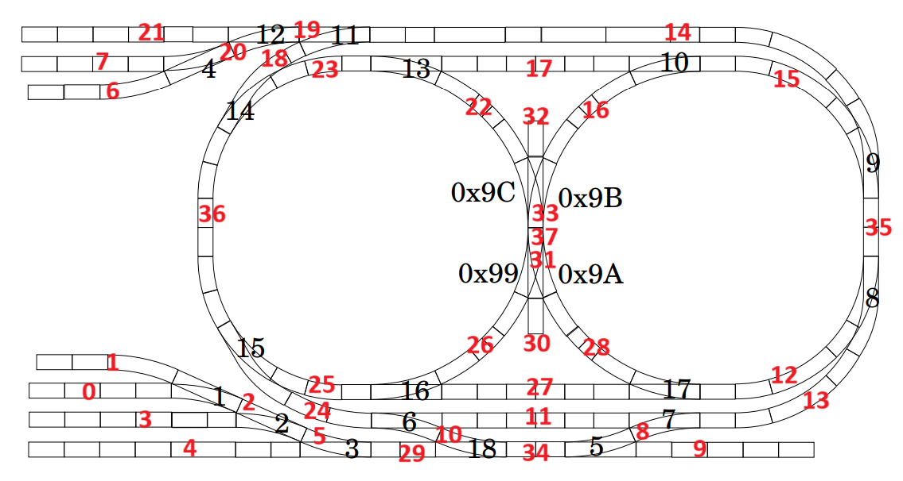

## TC2

### Logistics
Sam Liu (s742liu, 20938864), Kevin Guo (k54guo, 20903138)

<a href="https://git.uwaterloo.ca/cs452-sl-kg/cs452">GitLab</a>

### Task Design
We have several keys tasks that communicate with each other:
- `train_task`: maintains all train state, including speed, current route, current position, intended destination, etc.
- `state_task`: maintains all track-related state, including switches, reservations, and sensors.
- `sensor_task`: repeatedly polls for sensor data and forwards it to the train task to assign to a train.
- `display_state_task`: polls all backend servers for displayable information and writes it to the console.

All tasks are set to priority one. We did not find any need to use other priorities, since we have a lot of spare idle time.

### Routing

The train is routed using Dijkstra’s algorithm. The system can forbid certain segments of the track from being used. In addition to being able to change direction at branches, we also allow the train to reverse after merges and at exits, as well as once at the beginning of its path. Once the path is calculated, the track nodes and the distances between them are stored in a `track_path` data structure, which is used by the train task.

### Stopping

To stop a train, we compute the node and offset at which the stop command should be issued, based on the stopping distance for that train. Since this stopping distance only applies for trains travelling at full speed, special handling is needed for shorter paths that aren’t long enough for the train to fully accelerate. Using our empirical values of the train’s start and stop acceleration, we can binary search the right amount of time to let the train accelerate for before issuing the stop command.

We calculate stop nodes and offsets for each reverse along the route, as well as the final stop. Furthermore, we need to consider the various offsets for each type of node we want to stop at. For example, when stopping to reverse at a merge, we need to ensure the train stops a fair distance after the node so that it can take the other branch. When reversing at an exit, we need to make sure the train stops slightly before the node.

Finally, when the model detects that the train is at the appropriate node and offset to stop at, it either creates a task to reverse the train or sends a command to stop the train, as appropriate.

### Model
Every five ticks, a notifier informs the train task to update the position model of each train. The train task uses the previous position of the train, the current speed of the train, and any acceleration periods to predict the new position of the train. We assume acceleration is constant, so the conventional kinematic equations are used.

A sensor trigger can be attributed to a train if according to the model, the train is within a reasonable distance to the sensor. Once attributed, the train’s position is updated to the position of the sensor. Effectively, sensors allow us to make real-time corrections to the internal models of the trains.

### Calibration Data

To determine train speed, we use the following loop of sensors `A3 C13 E7 D7 D9 E12 C6 B15`. We compute the distances between sensors manually and use polled sensor data to measure the time it takes for a train to move between sensors; the speed is the quotient of these two values. We allow the train to run around the loop ~10 times. We noticed that the speed of the train across different track pieces was fairly small (i.e. within ~3% of the average), so we used only the average speed in our program. 

To determine stopping distance, we issue a stop command when the train hits a specified sensor. We manually measure how far past the sensor the train reaches.

To determine starting time, we find a section of track that is overtly longer than the true starting distance. We experimentally determine the time `t` it takes for a train to traverse this section of the track from a standstill. We know there is some time `t’` at which the train stops accelerating and starts moving at a constant speed. We can use kinematic equations to determine the value of `t’`.

We put all measurements into src/train_data.c.

### Train Control

We used a reservation system to prevent collisions. The track is split up into segments, separated by branches and merges.

Each train reserves segments as it moves, looking ahead a set distance along its path and reserving all segments in that window. After a train reaches a sensor, it releases all segments before the sensor. If a train tries to reserve a segment that is already being reserved by another train, a collision is detected.

To resolve this, both trains are stopped. Then, we calculate two possible cases: one where train one is rerouted (i.e. routed again but forbidden the conflicted segment) and train two is allowed to continue, and another where train two is rerouted and train one is allowed to continue. These two cases are compared, and we choose the one which requires the least total distance travelled by the two trains. Then the trains are restarted according to their new routes.

### Execution

During the demo, random destinations are generated for each train. Note that certain destinations are disabled (e.g. it's impossible for a train to arrive at an enter node). Moreover, we disable destinations and segments that involve dead spots in the track.
